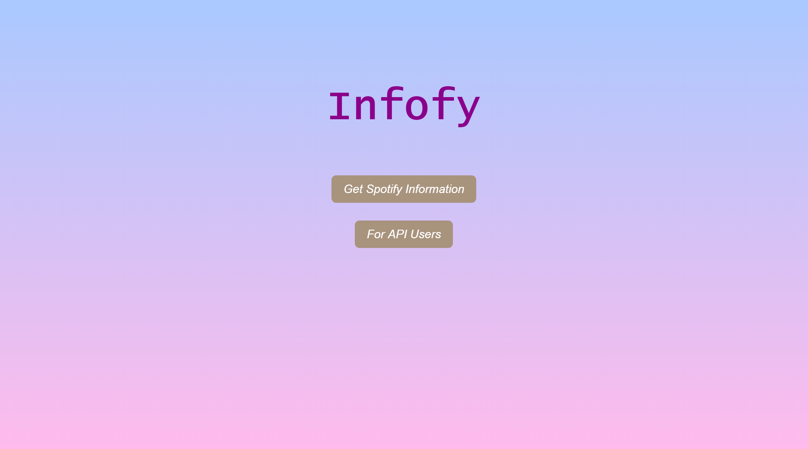
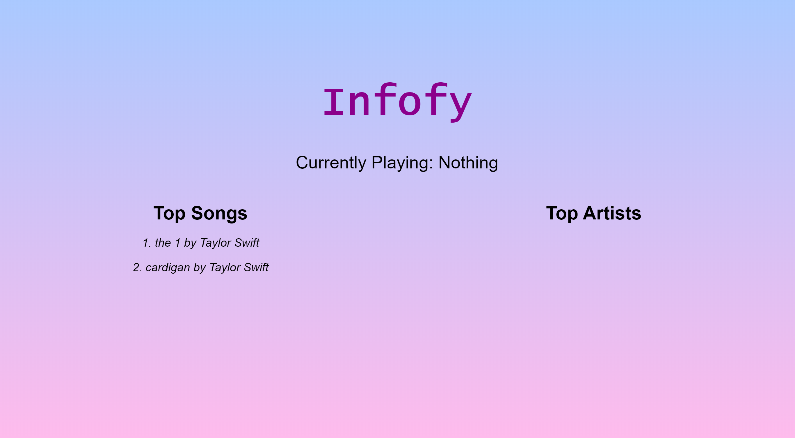
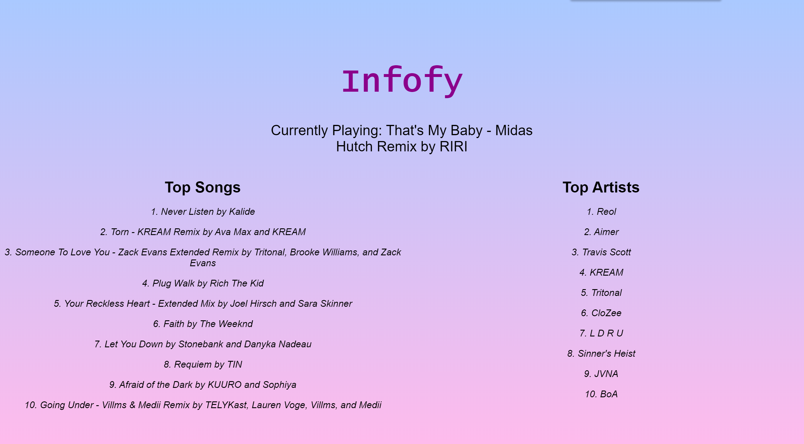

# Infofy - Spotify REST API Web Server

- Access Spotify information such as top songs, top artists, and the currently playing song.
- Up to 10 songs and artists can be shown at a time  
- Program pulls constantly so information such as currently playing song changes instantaneously.  
- Runs using Apache Tomcat on port 8080
- API Keys are outdated and only placeholders
  - Create your own at https://developer.spotify.com/

## Screenshots:

## REST API Endpoints 

Get Spotify API information(JSON)

- /infofy/api/token?code={access_token}

#### Depreciated Endpoints

Show all users

- /infofy/api/map

Create users

- /infofy/api/create?user={username}&pw={password}

Show user information

- /infofy/api/{username}

Gets data from Spotify for that user

- /infofy/api/{username}/token?code={access_token}

Get top songs

- /infofy/api/{username}/topSongs

Get top albums

- /infofy/api/{username}/topAlbums